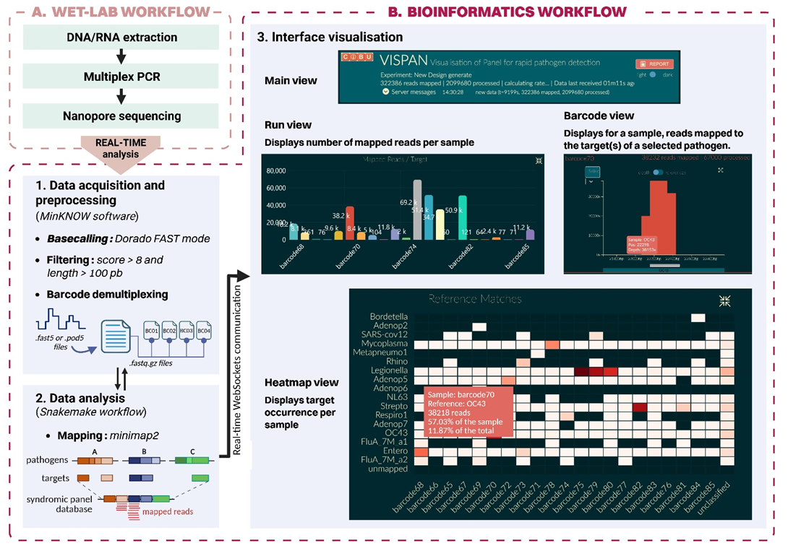

# gitlab-profile

# VisPan
Real-time visualization of multiplex syndromic PCR panel sequencing for rapid pathogens detection

 
 
 ## Documentation
* [Installation](https://github.com/PASTEUR-CIBU-detection/VisPan/blob/master/docs/installation.md)
* Files configuration for syndromic panels: [link](https://gitlab.pasteur.fr/cibu-detection/paneldesign/-/tree/main/panels)
 
  * Respiratory panel ([article](https://doi.org/10.1371/journal.pone.0264855))
  * Haemorrhagic fevers panel ([article](https://doi.org/10.1371/journal.pntd.0006075))
  * Vesicle-forming pathogen ([article](https://doi.org/10.3390/v14081817))

* Tool to configure your multiplex PCR panel: [link](https://github.com/PASTEUR-CIBU-detection/PanelDesign)
* Dataset example : This is a subset of a nanopore sequencing run. It was obtained with the respiratory syndromic panel (Twenty samples from barcode 65 to barcode 85).  [dataset.tar.gz](https://github.com/PASTEUR-CIBU-detection/PanelDesign)
## Acknowledgments
We would like to thank the developers of the [RAMPART](https://github.com/artic-network/) tool, which is part of the ARTICnetwork project and was funded by the Wellcome Trust.

## Funding
The work described in this manuscript was co-financed through the DURABLE project.
The DURABLE project has been co-funded by the European Union, under the EU4Health Programme (EU4H), Project no. 101102733
